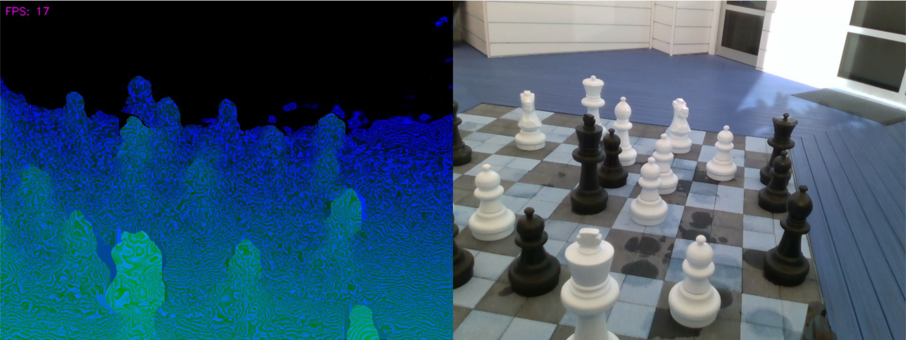

# Spout & Syphon RGB-D Example
An example which streams RGB-D images over spout / syphon with visiongraph.


*Source: Intel® RealSense™ [Sample Data](https://github.com/IntelRealSense/librealsense/blob/master/doc/sample-data.md)*

### Installation
It is recommended to use `Python 3.8` or higher and should run on any OS. First create a new [virtualenv](https://docs.python.org/3/library/venv.html) and activate it. 
After that install all dependencies:

```bash
# on MacOS use this:
pip install -r requirements-macos.txt

# on Windows use this:
pip install -r requirements-windows.txt
```

### Usage
Simply run the [demo.py](demo.py) with the following command to run a capturing pipeline (RealSense based). After that you can open a [spout receiver](https://github.com/leadedge/Spout2/releases) and check the result there.

```
python demo.py --input realsense
```

#### Depth Encoding
By default the depthmap is encoded by the realsense colorizer. It is possible to change the behaviour to use a specific encoding method. Be aware that some functions have an impact on performance because of the power calculation. Here is a list of all available:

```
Colorizer, Linear, Quad, Cubic, Quart, Quint
```

And it is possible to set the specific encoding by using the `--depth-encoding` parameter or by using the number keys on the viewer (0 = Colorizer, 1 = Linear, ..).

```
python demo.py --input realsense --depth-encoding Quad
```

#### Bit Depth
By default the bit depth is 8bit, but it is also possible to change it to a 16 bit encoding where two color channels (blue, green) are used. Green for the most significant bits and blue for the least significant bits (little-endian).
To change the bit-depth use the parameter `--bit-depth` or the keyboard key `b` in the viewer:

```
python demo.py --input realsense --depth-encoding Quad --bit-depth 16
```

#### Distance Range
To define the min and max distance to encode, use the `--min-distance` and `--max-distance` parameter.

#### Help

```
usage: demo.py [-h] [--depth-encoding Colorizer,Linear,Quad,Cubic,Quart,Quint]
               [--min-distance MIN_DISTANCE] [--max-distance MAX_DISTANCE]
               [--bit-depth {8,16}] [--input video-capture,realsense]
               [--input-size width height] [--input-fps INPUT_FPS]
               [--input-rotate 90,-90,180] [--input-flip h,v] [--raw-input]
               [--channel CHANNEL] [--input-skip INPUT_SKIP] [-ir]
               [--exposure EXPOSURE] [--gain GAIN] [--rs-serial RS_SERIAL]
               [--rs-play-bag RS_PLAY_BAG] [--rs-record-bag RS_RECORD_BAG]
               [--disable-emitter] [--depth]
               [--rs-filter decimation,spatial,temporal,hole-filling [decimation,spatial,temporal,hole-filling ...]]
               [--depth-as-input]
               [--color-scheme Jet,Classic,WhiteToBlack,BlackToWhite,Bio,Cold,Warm,Quantized,Pattern]
               [--no-filter]

RGB-D framebuffer sharing demo for visiongraph

optional arguments:
  -h, --help            show this help message and exit
  --depth-encoding Colorizer,Linear,Quad,Cubic,Quart,Quint
                        Method how the depth map will be encoded, default:
                        Colorizer.
  --min-distance MIN_DISTANCE
                        Min distance to perceive by the camera.
  --max-distance MAX_DISTANCE
                        Max distance to perceive by the camera.
  --bit-depth {8,16}    Encoding output bit depth (default: 8).

input provider:
  --input video-capture,realsense
                        Image input provider, default: video-capture.
  --input-size width height
                        Requested input media size.
  --input-fps INPUT_FPS
                        Requested input media framerate.
  --input-rotate 90,-90,180
                        Rotate input media.
  --input-flip h,v      Flip input media.
  --raw-input           Skip automatic input conversion to 3-channel image.
  --channel CHANNEL     Input device channel (camera id, video path, image
                        sequence).
  --input-skip INPUT_SKIP
                        If set the input will be skipped to the value in
                        milliseconds.
  -ir, --infrared       Use infrared as input stream (RealSense).
  --exposure EXPOSURE   Exposure value (usec) for realsense input (disables
                        auto-exposure).
  --gain GAIN           Gain value for realsense input (disables auto-
                        exposure).
  --rs-serial RS_SERIAL
                        RealSense serial number to choose specific device.
  --rs-play-bag RS_PLAY_BAG
                        Path to a pre-recorded bag file for playback.
  --rs-record-bag RS_RECORD_BAG
                        Path to a bag file to store the current recording.
  --disable-emitter     Disable RealSense IR emitter.
  --depth               Enable RealSense depth stream.
  --rs-filter decimation,spatial,temporal,hole-filling [decimation,spatial,temporal,hole-filling ...]
                        RealSense depth filter.
  --depth-as-input      Use colored depth stream as input stream.
  --color-scheme Jet,Classic,WhiteToBlack,BlackToWhite,Bio,Cold,Warm,Quantized,Pattern
                        Color scheme for depth map, default: WhiteToBlack.
  --no-filter           Disable realsense image filter.
```

### About
Copyright (c) 2022 Florian Bruggisser