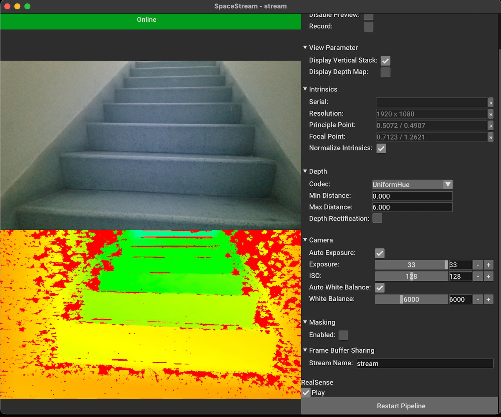

# Space Stream [](https://pypi.org/project/space-stream/)
Send RGB-D images over spout / syphon with visiongraph.


*Source: Intel® RealSense™ [Sample Data](https://github.com/IntelRealSense/librealsense/blob/master/doc/sample-data.md)*

### Installation
It is recommended to use `Python 3.8`, `Python 3.9` or `Python 3.10` and should run on any OS. First create a new [virtualenv](https://docs.python.org/3/library/venv.html) and activate it. 
After that install all dependencies:

```bash
pip install space-stream
```

#### ZED Camera
To be able to use a ZED Camera, please follow the tutorial on the [ZED Python API](https://www.stereolabs.com/docs/app-development/python/install/) website.

1. Install the [ZED SDK](https://www.stereolabs.com/developers/release/) (together with CUDA)
2. Run the command `python "C:\Program Files (x86)\ZED SDK\get_python_api.py"` inside the virtual python environment

### Usage
Simply run the `spacestream` module with the following command to run a capturing pipeline (RealSense based). After that you can open a [spout receiver](https://github.com/leadedge/Spout2/releases) / syphon receiver and check the result there.

```
space-stream --input realsense
```

To use the Azure Kinect use the `azure` input type:

```
space-stream --input azure
```

### Development
To develop with this project, clone the git repository and install the dependencies from the requirements:

```bash
pip install -r requirements.txt
```

To call the module directly, use the `-m` command from python:

```
python -m spacestream
```

#### Depth Codec
By default the depthmap is encoded by the linear codec. It is possible to change the behaviour to use a specific encoding method. Be aware that some functions have an impact on performance. Here is a list of all available codecs:

```
Linear,
UniformHue
InverseHue
```

The codecs `UniformHue` and `InverseHue` are implemented according to the Intel whitepaper about [Depth image compression by colorization](https://dev.intelrealsense.com/docs/depth-image-compression-by-colorization-for-intel-realsense-depth-cameras).

#### Bit Depth
The encoded bit-depth depends on the codec used. For `Linear` codec there are two different bit-depths encoded. First the `8-bit` encoding in the `red` channel and `16-bit` encoded values in the `green` (MSB) and `blue` (LSB) channel.

#### Distance Range
To define the min and max distance to encode, use the `--min-distance` and `--max-distance` parameter.

#### Help

```
usage: space-stream [-h] [-c CONFIG] [-s SETTINGS]
                    [--loglevel {critical,error,warning,info,debug}]
                    [--record RECORD]
                    [--codec Linear, UniformHue, InverseHue, RSColorizer]
                    [--min-distance MIN_DISTANCE]
                    [--max-distance MAX_DISTANCE] [--stream-name STREAM_NAME]
                    [--input video-capture,image,realsense,azure,camgear,zed]
                    [--input-size width height] [--input-fps INPUT_FPS]
                    [--input-rotate 90,-90,180] [--input-flip h,v]
                    [--input-mask INPUT_MASK] [--input-crop x y width height]
                    [--raw-input] [--channel CHANNEL]
                    [--input-skip INPUT_SKIP]
                    [--input-backend any,vfw,v4l,v4l2,firewire,fireware,ieee1394,dc1394,cmu1394,qt,unicap,dshow,pvapi,openni,openni_asus,android,xiapi,avfoundation,giganetix,msmf,winrt,intelperc,openni2,openni2_asus,gphoto2,gstreamer,ffmpeg,images,aravis,opencv_mjpeg,intel_mfx,xine]
                    [-src SOURCE] [--input-path INPUT_PATH]
                    [--input-delay INPUT_DELAY] [--exposure EXPOSURE]
                    [--gain GAIN] [--white-balance WHITE_BALANCE] [--depth]
                    [--depth-as-input] [-ir] [--rs-serial RS_SERIAL]
                    [--rs-json RS_JSON] [--rs-play-bag RS_PLAY_BAG]
                    [--rs-record-bag RS_RECORD_BAG] [--rs-disable-emitter]
                    [--rs-bag-offline]
                    [--rs-auto-exposure-limit RS_AUTO_EXPOSURE_LIMIT]
                    [--rs-auto-gain-limit RS_AUTO_GAIN_LIMIT]
                    [--rs-filter decimation,spatial,temporal,hole-filling [decimation,spatial,temporal,hole-filling ...]]
                    [--rs-color-scheme Jet,Classic,WhiteToBlack,BlackToWhite,Bio,Cold,Warm,Quantized,Pattern]
                    [--k4a-align-to-color] [--k4a-align-to-depth]
                    [--k4a-device K4A_DEVICE] [--k4a-depth-clipping min max]
                    [--k4a-ir-clipping min max] [--k4a-play-mkv K4A_PLAY_MKV]
                    [--k4a-record-mkv K4A_RECORD_MKV]
                    [--k4a-depth-mode OFF,NFOV_2X2BINNED,NFOV_UNBINNED,WFOV_2X2BINNED,WFOV_UNBINNED,PASSIVE_IR]
                    [--k4a-passive-ir]
                    [--k4a-color-resolution OFF,RES_720P,RES_1080P,RES_1440P,RES_1536P,RES_2160P,RES_3072P]
                    [--k4a-color-format COLOR_MJPG,COLOR_NV12,COLOR_YUY2,COLOR_BGRA32,DEPTH16,IR16,CUSTOM8,CUSTOM16,CUSTOM]
                    [--k4a-wired-sync-mode STANDALONE,MASTER,SUBORDINATE]
                    [--k4a-subordinate-delay-off-master-usec K4A_SUBORDINATE_DELAY_OFF_MASTER_USEC]
                    [--midas] [--mask]
                    [--segnet mediapipe,mediapipe-light,mediapipe-heavy]
                    [--parallel] [--num-threads NUM_THREADS] [--no-fastmath]
                    [--no-filter] [--no-preview] [--record-crf RECORD_CRF]
                    [--view-pcd] [--view-3d]

RGB-D framebuffer sharing demo for visiongraph.

options:
  -h, --help            show this help message and exit
  -c CONFIG, --config CONFIG
                        Configuration file path.
  -s SETTINGS, --settings SETTINGS
                        Settings file path (json).
  --loglevel {critical,error,warning,info,debug}
                        Provide logging level. Example --loglevel debug,
                        default=warning
  --record RECORD       Record output into recordings folder.
  --codec Linear, UniformHue, InverseHue, RSColorizer
                        Codec how the depth map will be encoded.
  --min-distance MIN_DISTANCE
                        Min distance to perceive by the camera.
  --max-distance MAX_DISTANCE
                        Max distance to perceive by the camera.
  --stream-name STREAM_NAME
                        Spout / Syphon stream name.

input provider:
  --input video-capture,image,realsense,azure,camgear,zed
                        Image input provider, default: video-capture.
  --input-size width height
                        Requested input media size.
  --input-fps INPUT_FPS
                        Requested input media framerate.
  --input-rotate 90,-90,180
                        Rotate input media.
  --input-flip h,v      Flip input media.
  --input-mask INPUT_MASK
                        Path to the input mask.
  --input-crop x y width height
                        Crop input image.
  --raw-input           Skip automatic input conversion to 3-channel image.
  --channel CHANNEL     Input device channel (camera id, video path, image
                        sequence).
  --input-skip INPUT_SKIP
                        If set the input will be skipped to the value in
                        milliseconds.
  --input-backend any,vfw,v4l,v4l2,firewire,fireware,ieee1394,dc1394,cmu1394,qt,unicap,dshow,pvapi,openni,openni_asus,android,xiapi,avfoundation,giganetix,msmf,winrt,intelperc,openni2,openni2_asus,gphoto2,gstreamer,ffmpeg,images,aravis,opencv_mjpeg,intel_mfx,xine
                        VideoCapture API backends identifier., default: any.
  -src SOURCE, --source SOURCE
                        Generic input source for all inputs.
  --input-path INPUT_PATH
                        Path to the input image.
  --input-delay INPUT_DELAY
                        Input delay time (s).
  --exposure EXPOSURE   Exposure value (usec) for depth camera input (disables
                        auto-exposure).
  --gain GAIN           Gain value for depth input (disables auto-exposure).
  --white-balance WHITE_BALANCE
                        White-Balance value for depth input (disables auto-
                        white-balance).
  --depth               Enable RealSense depth stream.
  --depth-as-input      Use colored depth stream as input stream.
  -ir, --infrared       Use infrared as input stream.
  --rs-serial RS_SERIAL
                        RealSense serial number to choose specific device.
  --rs-json RS_JSON     RealSense json configuration to apply.
  --rs-play-bag RS_PLAY_BAG
                        Path to a pre-recorded bag file for playback.
  --rs-record-bag RS_RECORD_BAG
                        Path to a bag file to store the current recording.
  --rs-disable-emitter  Disable RealSense IR emitter.
  --rs-bag-offline      Disable realtime bag playback.
  --rs-auto-exposure-limit RS_AUTO_EXPOSURE_LIMIT
                        Auto exposure limit (ms).
  --rs-auto-gain-limit RS_AUTO_GAIN_LIMIT
                        Auto gain limit (16-248).
  --rs-filter decimation,spatial,temporal,hole-filling [decimation,spatial,temporal,hole-filling ...]
                        RealSense depth filter.
  --rs-color-scheme Jet,Classic,WhiteToBlack,BlackToWhite,Bio,Cold,Warm,Quantized,Pattern
                        Color scheme for depth map, default: WhiteToBlack.
  --k4a-align-to-color  Align azure frames to color frame.
  --k4a-align-to-depth  Align azure frames to depth frame.
  --k4a-device K4A_DEVICE
                        Azure device id.
  --k4a-depth-clipping min max
                        Depth input clipping.
  --k4a-ir-clipping min max
                        Infrared input clipping.
  --k4a-play-mkv K4A_PLAY_MKV
                        Path to a pre-recorded bag file for playback.
  --k4a-record-mkv K4A_RECORD_MKV
                        Path to a mkv file to store the current recording.
  --k4a-depth-mode OFF,NFOV_2X2BINNED,NFOV_UNBINNED,WFOV_2X2BINNED,WFOV_UNBINNED,PASSIVE_IR
                        Azure depth mode, default: NFOV_UNBINNED.
  --k4a-passive-ir      Use passive IR input.
  --k4a-color-resolution OFF,RES_720P,RES_1080P,RES_1440P,RES_1536P,RES_2160P,RES_3072P
                        Azure color resolution (overwrites input-size),
                        default: RES_720P.
  --k4a-color-format COLOR_MJPG,COLOR_NV12,COLOR_YUY2,COLOR_BGRA32,DEPTH16,IR16,CUSTOM8,CUSTOM16,CUSTOM
                        Azure color image format, default: COLOR_BGRA32.
  --k4a-wired-sync-mode STANDALONE,MASTER,SUBORDINATE
                        Synchronization mode when connecting two or more
                        devices together, default: STANDALONE.
  --k4a-subordinate-delay-off-master-usec K4A_SUBORDINATE_DELAY_OFF_MASTER_USEC
                        The external synchronization timing.
  --midas               Use midas for depth capture.

masking:
  --mask                Apply mask by segmentation algorithm.
  --segnet mediapipe,mediapipe-light,mediapipe-heavy
                        Segmentation Network, default: mediapipe.

performance:
  --parallel            Enable parallel for codec operations.
  --num-threads NUM_THREADS
                        Number of threads for parallelization.
  --no-fastmath         Disable fastmath for codec operations.

debug:
  --no-filter           Disable realsense image filter.
  --no-preview          Disable preview to speed.
  --record-crf RECORD_CRF
                        Recording compression rate.
  --view-pcd            Display PCB preview (deprecated, use --view-3d).
  --view-3d             Display PCB preview.

Args that start with '--' can also be set in a config file (specified via -c).
Config file syntax allows: key=value, flag=true, stuff=[a,b,c] (for details,
see syntax at https://goo.gl/R74nmi). In general, command-line values override
config file values which override defaults.
```

### About
Copyright (c) 2023 Florian Bruggisser
